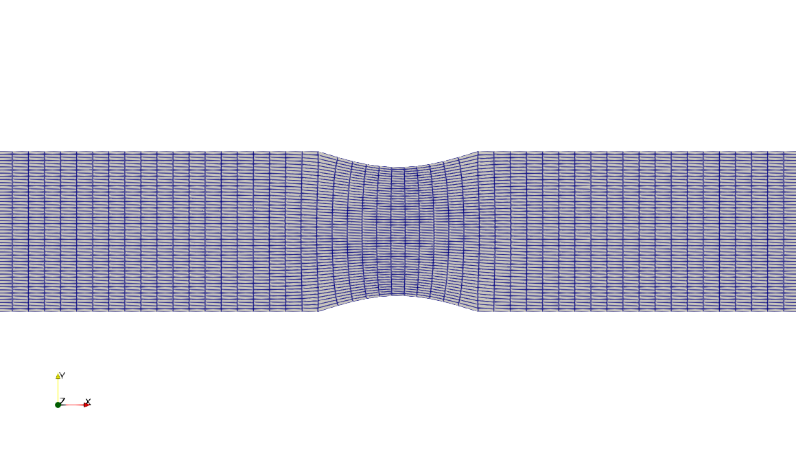

# laplaceGridGenerator

This project implements a Laplace (elliptic) mesh generator, a classical method for producing smooth, boundary-fitted mesh.
The interior grid points are obtained by solving the Laplace equations, using the finite difference method and the Gauss-Seidel algorithm.

